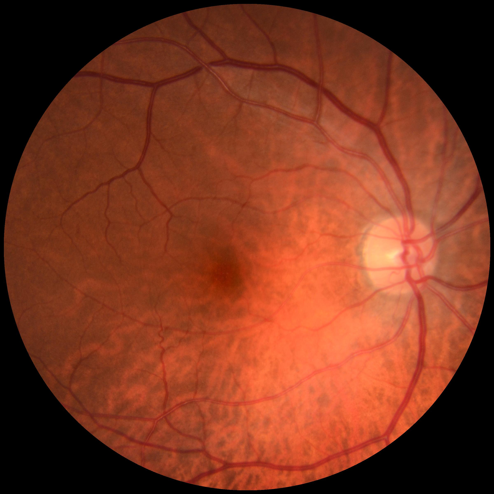
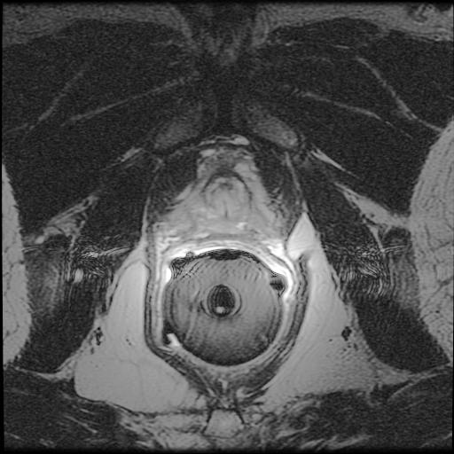
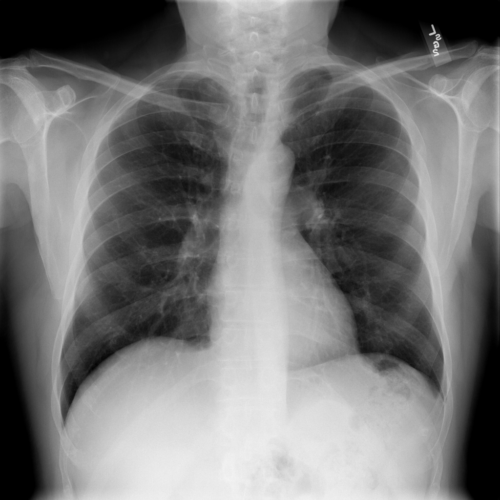
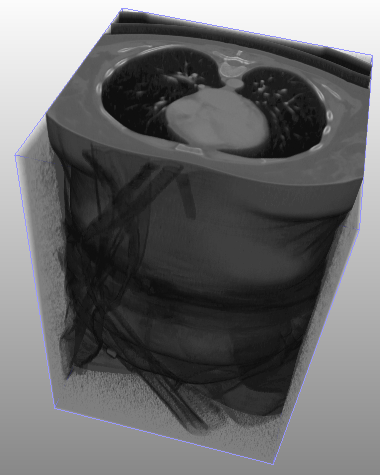
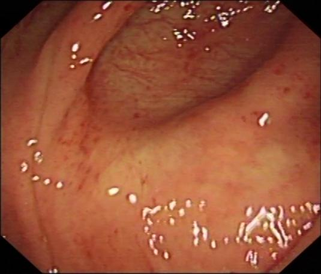
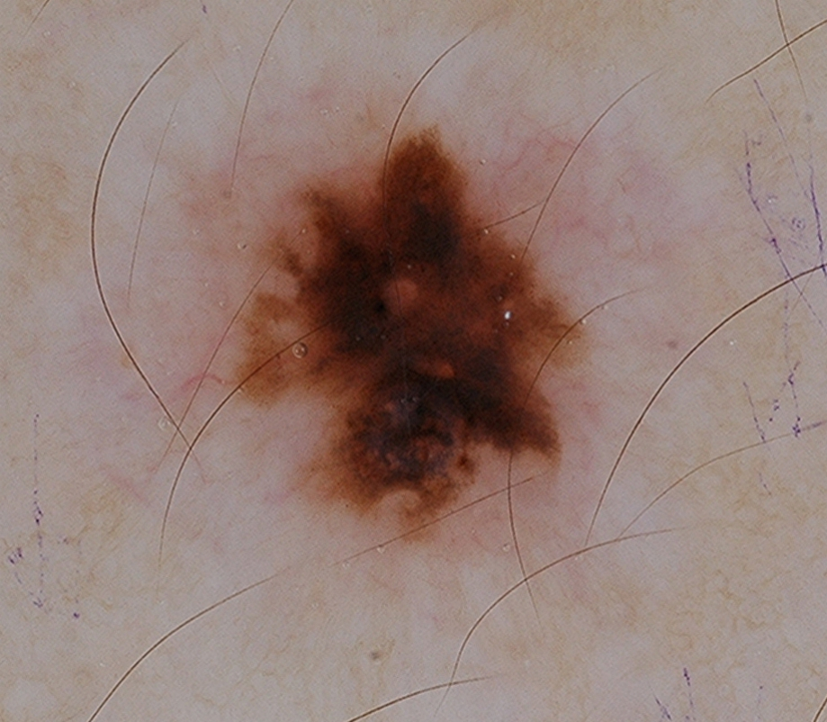
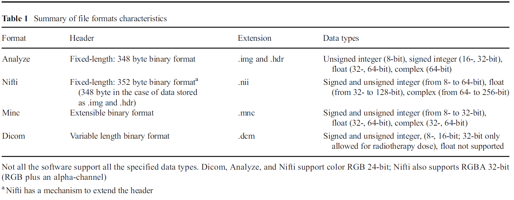

# Aewsome Medical Images

## 1. Modalities

### 1.1 Retinal fundus images

#### (1) [DRIVE dataset](http://www.isi.uu.nl/Research/Databases/DRIVE/)

The DRIVE dataset was obtained from a diabetic retinopathy screening program in the Netherlands which consisted of 400 diabetic subjects between 25 - 90 years of age, but only 40 images were randomly selected for training and testing which both contain 20 images. For the 40 images, there are 7 images show signs of mild early diabetic retinopathy. In addition, all the images were made by 3CCD camera and each has size of 565  584. For each image, a corresponding mask image is also provided.

#### (2) [STARE dataset](http://www.ces.clemson.edu/~ahoover/stare/)

The STARE dataset consists of 20 retinal fundus slides captured by a TopCon TRV-50 fundus camera. All the images have the size of $700 \times 605$. Half of the dataset comprises images of healthy subjects,and the rest contains the pathological cases. As widely known, the pathological example makes the segmentation more challenging.

#### (3) [CHASE dataset](https://blogs.kingston.ac.uk/retinal/chasedb1/)

The CHASE dataset is a subset of retinal images of multiethnic children from the Child Heart and Health Study in England and comprises 28 images with a resolution of $1280 \times 960$ pixels.

#### (4) [ODIR dataset](https://odir2019.grand-challenge.org/dataset/)

We collected a structured ophthalmic database of 5,000 patients with age, color fundus photographs from left and right eyes and doctors' diagnostic keywords from doctors (in short, ODIR-5K). This dataset is ‘‘real-life’’ set of patient information collected by Shanggong Medical Technology Co., Ltd. from different hospitals/medical centers in China. In these institutions, fundus images are captured by various cameras in the market, such as Canon, Zeiss and Kowa, resulting into varied image resolutions. Patient identifying information will be removed. Annotations are labeled by trained human readers with quality control management. They classify patient into eight labels including normal (N), diabetes (D), glaucoma (G), cataract (C), AMD (A), hypertension (H), myopia (M) and other diseases/abnormalities (O) based on both eye images and additionally patient age. The publishing of this dataset follows the ethical and privacy rules of China. Table 1 shows one record from ODIR-5K dataset.  Note: In the testing round, the diagnostic keywords will not be provided.

### 1.2 OCT

### 1.3 Ultrasound

### 1.4 Histopathological images

### 1.5 Magnetic resonance imaging (MR)

#### [Transversal T2-weighted MR image of the prostate](https://promise12.grand-challenge.org/Details/)

There are 50 training cases available for download. These cases include a transversal T2-weighted MR image of the prostate. The training set is a representative set of the types of MR images acquired in a clinical setting. The data is multi-center and multi-vendor and has different acquistion protocols (e.g. differences in slice thickness, with/without endorectal coil). The set is selected such that there is a spread in prostate sizes and appearance. For each of the cases in the training set, a reference segmentation is also included.

Each downloaded file contains MR scans, stored in Meta (or MHD/RAW) format. This format stores an image as an ASCII readable header file with extension .mhd and a separate binary file for the image data with extension .raw. This format is ITK compatible. Documentation is available here. Applications that can read the data are MeVisLab, SNAP, Slicer or ParaView. If you want to write your own code to read the data, note that in the header file you can find the dimensions of the scan and the voxel spacing. In the raw file the values for each voxel are stored consecutively with index running first over x, then y, then z. The voxel-to-world matrix is also available in this header file.

The voxel type for T2-weighted images is SHORT (16 bit signed). The voxel type for the reference standard image is CHAR (8 bit signed). The reference standard image only contains the values 1 for prostate and 0 for background.

#### [ACDC dataset](https://acdc.creatis.insa-lyon.fr/description/databases.html)

This set consists of 100 cine magneticresonance (MR) exams covering well defined pathologies:  dilated cardiomyopathy, hypertrophiccardiomyopathy, myocardial infarction with altered left ventricular ejection fraction and abnormalright ventricle.  It also included normal subjects.  The exams were acquired in breath-hold with aretrospective or prospective gating and a SSFP sequence in 2-chambers, 4-chambers and in short-axisorientations. A series of short-axis slices cover the LV from the base to the apex, with a thickness of5 to 8 mm and an inter-slice gap of 5 mm. The spatial resolution goes from 0.83 to 1.75 mm2/pixel

### x-rays

#### [MURA](https://stanfordmlgroup.github.io/competitions/mura/)

#### [ChestX-ray8](http://openaccess.thecvf.com/content_cvpr_2017/papers/Wang_ChestX-ray8_Hospital-Scale_Chest_CVPR_2017_paper.pdf)

### CT scans

#### [KITS](https://kits19.grand-challenge.org)

### Endoscope/Dermatoscope

#### [EAD2019](https://ead2019.grand-challenge.org/)

#### [ISIC2019](https://challenge2019.isic-archive.com/)

### 

Find more -> **[go down](#medical-imaging-datasets)**

## 2. [Medical Image File Formats](https://www.ncbi.nlm.nih.gov/pmc/articles/PMC3948928/)

Image file format is often a confusing aspect for someone wishing to process medical images.

### Basic concepts: pixel depth, photometric interpretation, metadata, and pixel data

What the numerical value of the pixel expresses depends on the imaging modality, the acquisition protocol, the reconstruction, and eventually, the post-processing.

#### pixel depth: the number of bits used to encode the information of each pixel

16bit: 0 to 65535
16bit: −32,768 to 32,767

Image data may also be real numbers: single precision 32-bit and the double precision 64-bit

#### photometric interpretation: specifies how the pixel data should be interpreted for the correct image display as a monochrome or color image

- samples per pixel or number of channels to determine monochrome or color 

- Clinical radiological images, like x-ray computed tomography (CT) and magnetic resonance (MR) images have a gray scale photometric interpretation.

- Nuclear medicine images, like positron emission tomography (PET) and single photo emission tomography (SPECT), are typically displayed with a color map or color palette. In this case, each pixel of the image is associated with a color in a predefined color map (only used for visualization). also single channel. (pseudo-color).

- Ultrasound images are typically stored employing R-G-B color model, 24-bits pixel depth, true color.

- Doppler ultrasound, use color to encode blood flow direction (and velocity) to show additional functional information onto a gray scale anatomical image as colored overlays, as in the case of fMRI activation sites, to simultaneously display functional and anatomical images as in the PET/CT or PET/MRI, and sometimes in place of gray tones to highlight signal differences.

#### Metadata: information that describe the images

In any file format, there is always information associated with the image beyond the pixel data, called as metadata, typically stored at the beginning of the file as a header and contains at least the image matrix dimensions, the spatial resolution, the pixel depth, and the photometric interpretation. The software uses it to recognize and correctly open an image in a supported file format.

In the case of medical images, images coming from diagnostic modalities typically have information about how the image was produced. MRI: parameters related to the pulse sequence used, timing information, flip angle, number of acquisitions. PET: have information about radiopharmaceutical injected and the weight of the patient. These data allows software to on-the-fly covert pixel values in standardized uptake values (SUV). 

Post-processing file formats have a terser metadata section that essentially describes the pixel data. 

#### Pixel data: 

- radiological images like CT and MR and also modern nuclear medicine modalities, like PET and SPECT, store 16 bits for each pixel as integers.
- float data type is frequent in any post-processing pipeline
- may also be of complex type even if this data type is not common and can be bypassed by storing the real and imaginary parts as separate images: MRI store acquired data before the reconstruction (the so called k-space) or after the reconstruction if you choose to save both magnitude and phase image.
- little endian or big endian
- may also be compressed to reduce requirements for storage and transmission, lossless (reversible) or lossy (irreversible). In medical image, lossy tech 's usage is controversial, because it is not clear under which conditions the reading of the images and/or the quantitative post-processing procedures are not influenced by information loss.

### File formats

- intended to standardize the images generated by diagnostic modalities, e.g, Dicom.
- facilitate and strengthen post-processing analysis, e.g, Analyze, Nifti and Minc.

- a single file contains both metadata and image data, with the metadata stored at the beginning of the file: Dicom, Minc, and Nifti file formats.
- stores the metadata in one file and the image data in a second one: Analyze file format: .hdr and .img / Metaimage: .mhd and .raw

#### Analyze

old but widespread：

.hdr (metadata, 348 bytes, is described as a structure in the C programming language) and .img

#### Neuroimaging Informatics Technology Initiative (Nifti)
- Compared with Analyze： Image orientation with the intend to avoid the left-right ambiguity in brain study. support unsigned 16bit: .nii, 352 bytes header.
- a double way to store the orientation of the image volume in the space. rotation + translation to be used to map voxel coordinates to the scanner frame of reference, encoded using a matrix. affine. spatial normalization task is common in brain functional image analysis.

- Nifti-2: dimension of an image matrix supports a 64-bit integer instead of a 16-bit as in the Nifti-1 to manage larger data set. header: 544 bytes.

#### Digital Imaging and Communications in Medicine (Dicom)

Dicom standard is the backbone of every medical imaging department, is not only a file format but also a network communication protocol.

the header contains the most complete description of the entire procedure used to generate the image ever conceived in terms of acquisition protocol and scanning parameters. also patient information such as name, gender, age, weight, and height. The Dicom header is modality-dependent and varies in size.

Dicom can only store pixel values as integers. supports compressed image data through a mechanism that allow a non-Dicom-formatted document to be encapsulated in a Dicom: JPEG, run-lenght encoding (RLE), JPEG-LS, JPEG-2000, MPEG2/MPEG4 and Deflated. JPEG-XR.

Find more -> [https://itk.org/Wiki/ITK/File_Formats](https://itk.org/Wiki/ITK/File_Formats)

----------------------------

# medical-imaging-datasets

* A list of Medical imaging datasets. Source : https://sites.google.com/site/aacruzr/image-datasets
* An additional, possibly overlapping list can be found at : https://github.com/beamandrew/medical-data

### Multimodal databases

* Center for Invivo Microscopy (CIVM), Embrionic and Neonatal Mouse (H&E, MR) http://www.civm.duhs.duke.edu/devatlas/ 
user guide: http://www.civm.duhs.duke.edu/devatlas/UserGuide.pdf
* LONI image data archive https://ida.loni.usc.edu/services/Menu/IdaData.jsp?project=
* Radiology (Ultrasound, Mammographs, X-Ray, CT, MRI, fMRI, etc.)
* Collaborative Informatics and Neuroimaging Suite (COINS) https://portal.mrn.org/micis/index.php?subsite=dx
* The Cancer Imaging Archive (TCIA) http://www.cancerimagingarchive.net/ (Collections)
* Alzheimer’s Disease Neuroimaging Initiative (ADNI) http://adni.loni.ucla.edu/
* The Open Access Series of Imaging Studies (OASIS) http://www.oasis-brains.org/
* Breast Cancer Digital Repository https://bcdr.eu/
* DDSM: Digital Database for Screening Mammography http://marathon.csee.usf.edu/Mammography/Database.html
* The Mammographic Image Analysis Society (MIAS) mini-database http://peipa.essex.ac.uk/info/mias.html
* Mammography Image Databases 100 or more images of mammograms with ground truth. Additional images available by request, and links to several other mammography databases are provided http://marathon.csee.usf.edu/Mammography/Database.html
* NLM HyperDoc Visible Human Project color, CAT and MRI image samples - over 30 images http://www.nlm.nih.gov/research/visible/visible_human.html
* CT Scans for Colon Cancer https://wiki.cancerimagingarchive.net/display/Public/CT+COLONOGRAPHY#e88604ec5c654f60a897fa77906f88a6

### Histology and Histopathology (H&E, IHQ, ...)

* The Cancer Genome Atlas (TCGA) http://cancergenome.nih.gov/ https://tcga-data.nci.nih.gov/tcga/
* International Cancer Genome Consortium http://icgc.org, (Data portal) http://dcc.icgc.org/
* Stanford Tissue Microarray Database (TMA) http://tma.im
* MITOS dataset http://www.ipal.cnrs.fr/event/icpr-2012
* Cancer Image Database (caIMAGE) https://emice.nci.nih.gov/caimage
* DPA’s Whole Slide Imaging Repository https://digitalpathologyassociation.org/whole-slide-imaging-repository
* ITK Analysis of Large Histology Datasets http://www.na-mic.org/Wiki/index.php/ITK_Analysis_of_Large_Histology_Datasets
* Histology Photo Album http://www.histology-world.com/photoalbum/thumbnails.php?album=52
* Slide Library of Virtual pathology, University of Leeds http://www.virtualpathology.leeds.ac.uk/
* Aperio Images http://images.aperio.com/
* HAPS Histology Image Database http://hapshistology.wikifoundry.com/
* Microscopy (Cell, Cytology, Biology, Protein, Molecular, Fluorescence, etc.)
* BDGP images from the FlyExpress database www.flyexpress.net
* The UCSB Bio-Segmentation Benchmark dataset http://www.bioimage.ucsb.edu/research/biosegmentation
* Pap Smear database http://mde-lab.aegean.gr/index.php/downloads
* Histology (CIMA) dataset http://cmp.felk.cvut.cz/~borovji3/?page=dataset
* ANHIR dataset https://anhir.grand-challenge.org/

* Genome RNAi dataset http://www.genomernai.org/
* Chinese Hamster Ovary cells (CHO) dataset http://www.chogenome.org/data.html
* Locate Endogenus mouse sub-cellular organelles (END) database http://locate.imb.uq.edu.au/
* 2D HeLa dataset (HeLa) dataset https://ome.grc.nia.nih.gov/iicbu2008/hela/index.html
* Allen Brain Atlas http://www.brain-map.org/
* 1000 Functional Connectomes Project http://fcon_1000.projects.nitrc.org/
* The Cell Centered Database (CCDB) https://library.ucsd.edu/dc/collection/bb5940732k
* The Encyclopedia of DNA Elements (ENCODE) http://genome.ucsc.edu/ENCODE/ 
user guide: http://www.plosbiology.org/article/info:doi/10.1371/journal.pbio.1001046
* The Human Protein Atlas: http://www.proteinatlas.org/
* DRIVE: Digital Retinal Images for Vessel Extraction http://www.isi.uu.nl/Research/Databases/DRIVE/ (Ground truth)
* El Salvador Atlas of Gastrointestinal VideoEndoscopy Images and Videos of hi-res of studies taken from Gastrointestinal Video endoscopy http://www.gastrointestinalatlas.com/

### Databases you can use for benchmarking 

* http://peipa.essex.ac.uk/benchmark/databases/
* http://mulan.sourceforge.net/datasets-mlc.html
* https://archive.ics.uci.edu/ml/datasets.php
* Datasets reporting formats for pathologists http://www.rcpath.org/publications-media/publications/datasets
* DermNet - Skin disease atlas (23 image classes and 23,000 images): http://www.dermnet.com/

### State of the art / Challenges

* Grand Challenges in Medical Image Analysis https://grand-challenge.org/
* Challenges in global health and development problems https://grandchallenges.org/#/map
* Current state of the art of most used computer vision datasets: Who is the best at X? http://rodrigob.github.io/are_we_there_yet/build/
* Automatic Non-rigid Histological Image Registration (ANHIR) challenge https://anhir.grand-challenge.org/
