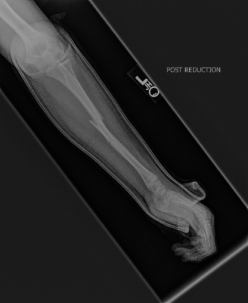
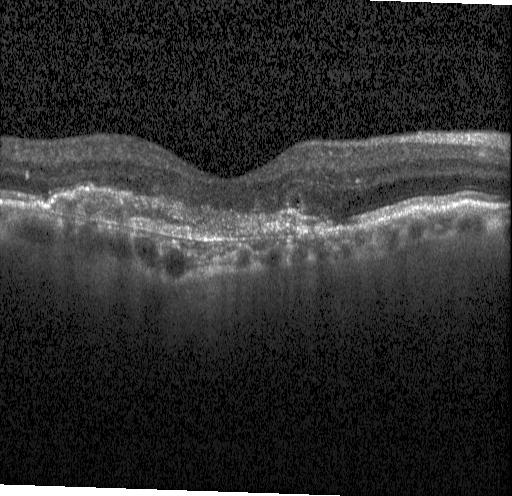
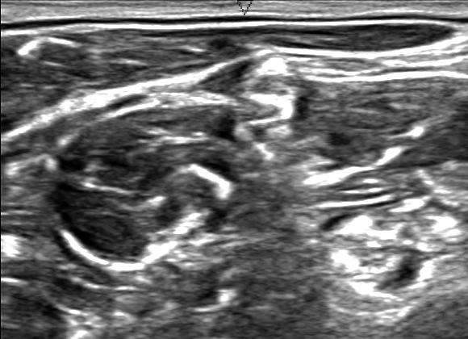
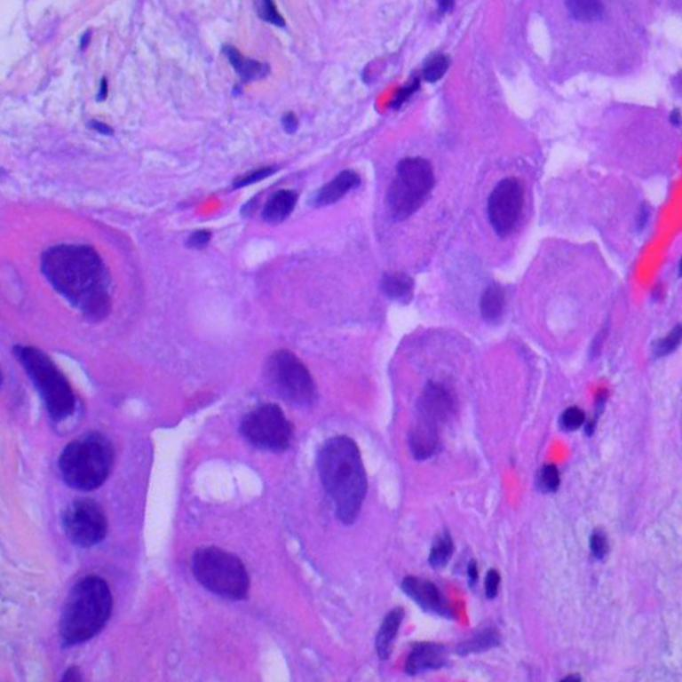

# MIADeepSSL: A Survey on Deep Learning of Small Sample in Biomedical Image Analysis

This page is for the [A Survey on Deep Learning of Small Sample in Biomedical Image Analysis](https://arxiv.org/abs/1908.00473).

We build MIADeepSSL demos using surveyed small sample learning techniques for deep learning in Biomedical Image Analysis. 


## Abstract

The success of deep learning has been witnessed as a promising technique for computer-aided biomedical image analysis, due to end-to-end learning framework and availability of large-scale labelled samples. However, in many cases of biomedical image analysis, deep learning techniques suffer from the small sample learning (SSL) dilemma caused mainly by lack of annotations. To be more practical for biomedical image analysis, in this paper we survey the key SSL techniques that help relieve the suffering of deep learning by combining with the development of related techniques in computer vision applications. In order to accelerate the clinical usage of biomedical image analysis based on deep learning techniques, we intentionally expand this survey to include the explanation methods for deep models that are important to clinical decision making. We survey the key SSL techniques by dividing them into five categories: (1) explanation techniques, (2) weakly supervised learning techniques, (3) transfer learning techniques, (4) active learning techniques, and (5) miscellaneous techniques involving data augmentation, domain knowledge, traditional shallow methods and attention mechanism. These key techniques are expected to effectively support the application of deep learning in clinical biomedical image analysis, and furtherly improve the analysis performance, especially when large-scale annotated samples are not available.

## Requirements

(1). pytorch >= 1.0


## [1. explanation techniques](./00_Interpretability)

We build demo based on two commonly used explanation methods for deep models, i.e., CAM (Class Activation Map) (Zhou et al., 2016) and Grad-CAM (Selvaraju et al., 2017), which are used to explain a DenseNet169 trained on [MURA (musculoskeletal radiographs, a large dataset of bone X-rays)](https://stanfordmlgroup.github.io/competitions/mura/).





## 2. weakly supervised learning techniques

We build two demos. One is weakly supervised object localization based on CAM and Grad-CAM introduced in [00_Interpretability](./00_Interpretability). The other one is weakly supervised semantic segmentation.

### Weakly supervised object localization

CAM built on the output of 4-st dense block


### Weakly supervised semantic segmentation

We build the demo of weakly supervised semantic segmentation on two methods：

- [ ] method 1: representive framework: pre-processing (region growing / K-means clustering) + ENet + post-processin (DenseCRF / Graph Search)

- [x] method 2: [Size Constrained-CNN](https://arxiv.org/abs/1805.04628): size constrained loss + ENet


(a) Full supervision: gt


(b) weak supervision 1： erosion operation on gt


(c) weak supervision 2： random point supervision 


(d) weak supervision 3： centroid point supervision 


(e) weak supervision 4： box supervision


------------

## 3. transfer learning techniques


------------

## 4. active learning techniques


------------


## 5. miscellaneous techniques


### (1) data augmentation

### (2) domain knowledge

### (3) traditional shallow methods

### (4) attention mechanism


------------

## [0. medical images](./MedicalImages)

- Retinal fundus images


- Retinal OCT Images (optical coherence tomography)



- Ultrasound



- Histopathological images



- Magnetic resonance imaging (MR)


- x-rays


- CT


---------------


TODO:

- [x] Build MIADeepSSL demo using explanation techniques

- [x] Build MIADeepSSL demo using weakly supervised learning techniques

- [ ] Build MIADeepSSL demo using transfer learning techniques

- [ ] Build MIADeepSSL demo using active learning techniques

- [ ] Build MIADeepSSL demo using attention mechanism

- [ ] Build MIADeepSSL demo using traditional shallow methods

- [ ] Build MIADeepSSL demo using domain knowledge


----------

## Citation

If you find this code useful for your research, please cite our paper:

```
@article{
  author    = {Pengyi Zhang, Yunxin Zhong, Yulin Deng, Xiaoying Tang, Xiaoqiong Li},
  title     = {A Survey on Deep Learning of Small Sample in Biomedical Image Analysis},
  journal   = {CoRR},
  volume    = {abs/1908.00473},
  year      = {2019},
  ee        = {https://arxiv.org/abs/1908.00473}
}

```
